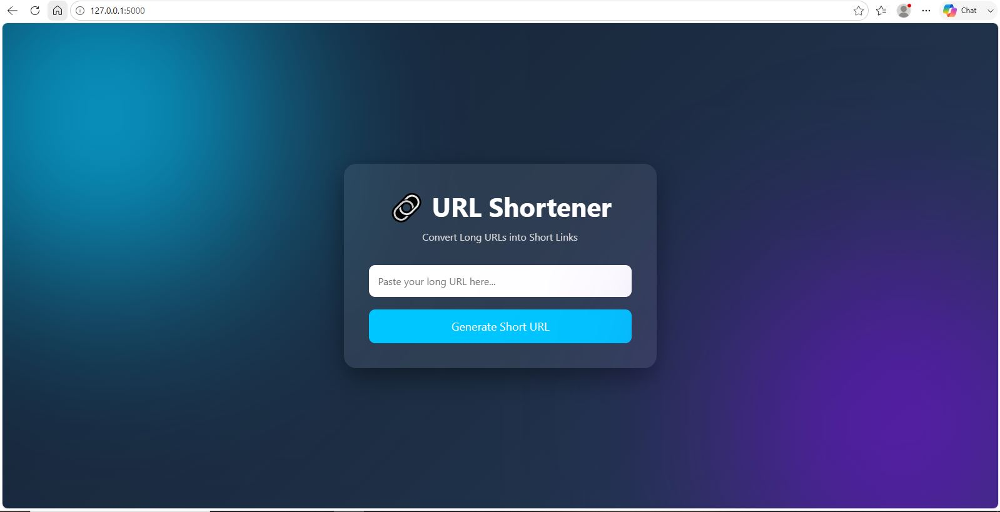
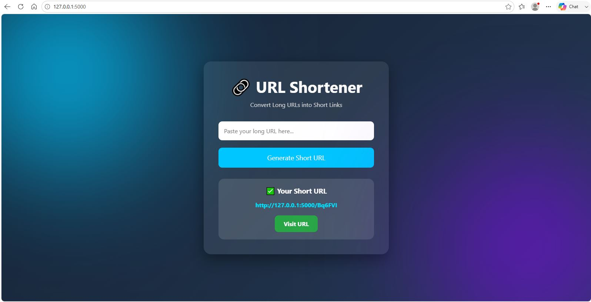
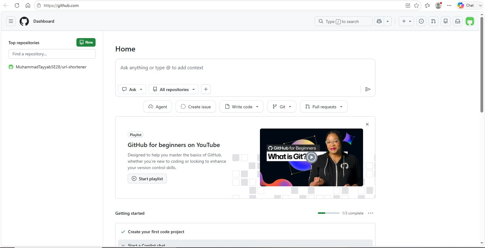

# URL Shortener

[](https://github.com/MuhammadTayyabSE28/url-shortener/actions/workflows/tests.yml)

A lightweight URL Shortener web application built with **Python, Flask, and SQLite**. It converts long URLs into short, unique links and redirects users to the original website when the shortened URL is accessed.

This project demonstrates Flask routing, form handling, SQLite database integration, URL generation, HTTP redirection, automated testing with pytest, Docker containerization, and GitHub Actions CI.

## Features

* Generate unique six-character short URLs
* Redirect shortened URLs to the original destination
* Store URL mappings in SQLite
* Responsive and user-friendly web interface
* Automated tests with pytest
* Dockerized application
* GitHub Actions CI pipeline
* Lightweight Flask-based architecture

## Technologies Used

* **Python 3.12**
* **Flask 3.1.3**
* **SQLite**
* **HTML5**
* **CSS3**
* **pytest 9.1.1**
* **Docker**
* **GitHub Actions**

## Project Structure

```text
url-shortener/
│
├── .github/
│   └── workflows/
│       └── tests.yml
│
├── screenshots/
│   ├── home-page.JPG
│   ├── short-url.JPG
│   └── redirect.JPG
│
├── templates/
│   └── index.html
│
├── tests/
│   └── test_app.py
│
├── .gitignore
├── app.py
├── Dockerfile
├── README.md
├── requirements.txt
└── urls.db
```

## How It Works

The application follows a simple flow:

```text
User enters a long URL
        ↓
Flask receives the POST request
        ↓
A random six-character short code is generated
        ↓
Original URL + short code are stored in SQLite
        ↓
Short URL is displayed to the user
        ↓
User visits the short URL
        ↓
Flask looks up the short code
        ↓
User is redirected to the original URL
```

## Installation

### 1. Clone the repository

```bash
git clone https://github.com/MuhammadTayyabSE28/url-shortener.git
```

### 2. Navigate to the project directory

```bash
cd url-shortener
```

### 3. Install dependencies

```bash
pip install -r requirements.txt
```

### 4. Run the application

```bash
python app.py
```

### 5. Open the application

Visit:

```text
http://127.0.0.1:5000
```

## Usage

1. Open the application in your browser.
2. Enter a valid long URL.

Example:

```text
https://www.google.com
```

3. Click **Generate Short URL**.
4. The application generates a short URL such as:

```text
http://127.0.0.1:5000/A1b2C3
```

5. Open the generated short URL.
6. The application redirects you to the original website.

## Database

The project uses **SQLite** to store URL mappings.

### `urls` table

| Column         | Type    | Description                     |
| -------------- | ------- | ------------------------------- |
| `id`           | INTEGER | Primary key with auto-increment |
| `original_url` | TEXT    | Original long URL               |
| `short_code`   | TEXT    | Generated unique short code     |

## Automated Testing

The project uses **pytest** to automatically verify the application's core behavior.

### Run tests

```bash
python -m pytest
```

The current test suite covers:

* Homepage availability
* Short URL creation
* Short URL redirection
* Invalid short URL handling

Current result:

```text
4 passed
```

## Docker

The application can run inside a Docker container.

### Build the Docker image

```bash
docker build -t url-shortener .
```

### Run the container

```bash
docker run -p 5000:5000 url-shortener
```

### Open the Dockerized application

Visit:

```text
http://localhost:5000
```

The Flask application is configured to listen on:

```text
0.0.0.0:5000
```

so it can be accessed through the Docker container's published port.

## Continuous Integration

This project uses **GitHub Actions** to automatically run the test suite whenever code is pushed to GitHub.

The workflow is located at:

```text
.github/workflows/tests.yml
```

The CI pipeline performs these steps:

```text
Push code to GitHub
        ↓
GitHub creates Ubuntu runner
        ↓
Checkout repository
        ↓
Set up Python 3.12
        ↓
Install dependencies
        ↓
Run pytest
        ↓
Build passes only when tests pass
```

The CI workflow can be viewed here:

https://github.com/MuhammadTayyabSE28/url-shortener/actions

## Screenshots

### Home Page



### Generated Short URL



### Redirect Result



## Future Improvements

* Custom short URLs
* Copy-to-clipboard button
* QR code generation
* Click analytics
* User authentication
* URL expiration
* Improved URL validation
* Production WSGI server
* Deployment to a cloud platform

## Author

**Muhammad Tayyab**

Software Engineering Student
SZABIST Islamabad

GitHub: https://github.com/MuhammadTayyabSE28

## License

This project was developed for educational and portfolio purposes.
